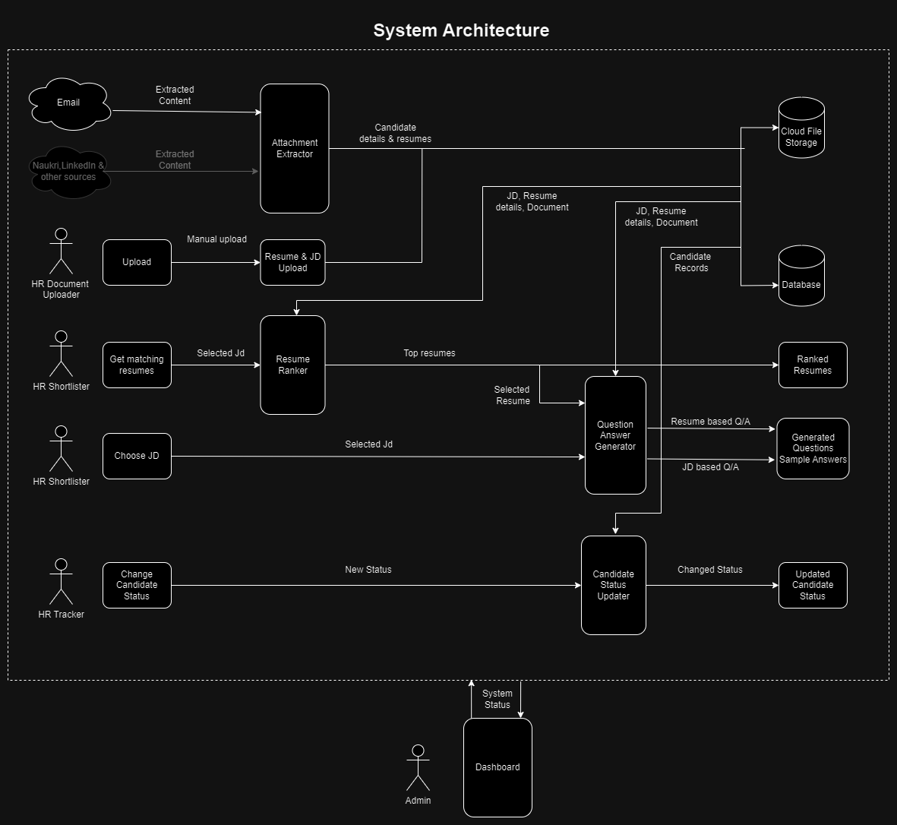

# System Architecture Documentation

## Diagram

## Overview
This system architecture represents a recruitment management system with various components handling resume processing, candidate management, and question generation.

## Input Sources
1. **Email**
   - Provides extracted content to the Attachment Extractor

2. **Naukri,LinkedIn & other sources**
   - Provides extracted content to the Attachment Extractor

3. **HR Document Uploader**
   - Performs manual upload through Upload interface
   - Connects to Resume & JD Upload component

## Core Components

### Attachment Extractor
- Receives extracted content from Email and Naukri/LinkedIn sources
- Outputs candidate details & resumes
- Stores data in Cloud File Storage

### Resume & JD Upload
- Receives manual uploads via HR Document Uploader
- Processes resume and JD documents
- Forwards data to Resume Ranker
- Stores JD, Resume details, Document in Database

### Resume Ranker
- Receives Selected JD input
- Processes resumes against job description
- Outputs top resumes
- Data stored as Ranked Resumes

### Question Answer Generator
- Receives inputs:
  - Selected Resume
  - Selected JD
- Generates two types of outputs:
  - Resume based Q/A
  - JD based Q/A
- Outputs stored as Generated Questions/Sample Answers

### Candidate Status Updater
- Receives New Status input from HR Tracker
- Updates candidate status
- Outputs Changed Status to Updated Candidate Status

## Storage Components

### Cloud File Storage
- Stores extracted candidate details & resumes

### Database
- Stores JD, Resume details, and Document information
- Maintains Candidate Records

## User Roles

### HR Shortlister
- Can "Get matching resumes"
- Can "Choose JD"

### HR Tracker
- Can "Change Candidate Status"

### Admin
- Has access to Dashboard
- Can view System Status

## Dashboard
- Provides system status information
- Accessible by Admin
- Bi-directional System Status communication

## Outputs
1. Ranked Resumes
2. Generated Questions/Sample Answers
3. Updated Candidate Status

